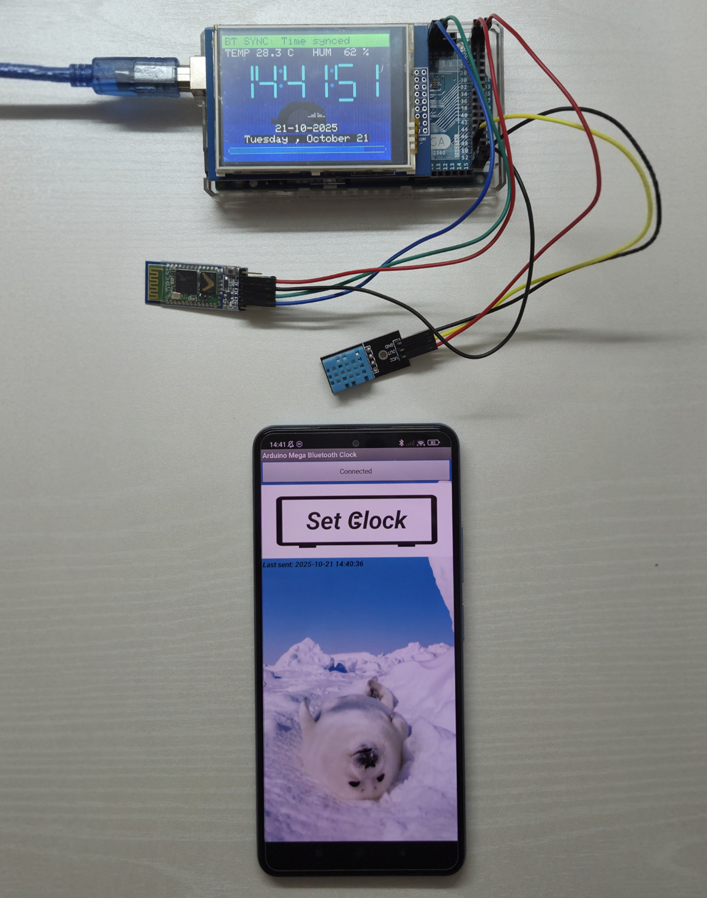

# Bluetooth Seal HUD Clock

An elegant, flicker-free **Heads-Up Display Clock** for the **Arduino Mega 2560** featuring:
**Bluetooth time sync**, **DHT11 temperature/humidity sensing**, and a smooth **animated ocean + seal background**.

Designed for stability and visual polish, this project minimizes LCD flicker through partial redraws, fixed-width glyphs, and per-digit refresh logic.

---

## Key Features

- **Bluetooth Time Sync (HC-05 via Serial1)**  
  Accepts either:
  - `HH:MM:SS`  
  - `YYYY-MM-DD HH:MM:SS`  
  Updates clock in real time upon receiving valid data (Using the Bluetooth_Clock_Sync.apk app).

- **Flicker-Free Display**  
  - Opaque redraw for TEMP/HUM text  
  - Smart digit updates (only changed segments)  
  - Optional hard refresh for minute/second digits

- **Dynamic Ocean Background & Seal Graphic**  
  - Multi-layer gradient ocean colors  
  - Custom-rendered seal with eyes, whiskers, and flippers  
  - Stable foreground blending with background restoration

- **Environment Data (DHT11)**  
  - Temperature (°C) and Humidity (%) displayed under title strip  
  - Smooth, hysteresis-based updates every 2 seconds  

- **Seconds Bar + Pulsing Colons**  
  - Animated cyan bar shows seconds progression  
  - Soft sinusoidal colon brightness pulse  

- **Date + Weekday Rendering**  
  - Dual-line layout: `DD-MM-YYYY` + `Weekday, Month Day`

---

## Components Used

| Component | Connection | Description |
|------------|-------------|-------------|
| **Arduino Mega 2560** | — | Main controller |
| **MCUFRIEND 2.8" TFT** | Parallel 8-bit interface | Main display |
| **Bluetooth (HC-05)** | `Serial1` (TX1/RX1) | Time sync input |
| **DHT11 Sensor** | Pin 48 | Temperature & humidity |
| **Optional SD Reader** | *Disabled (pins 10, 53 forced HIGH)* | Prevents SPI interference |

---

## Technical Highlights

- **Display Engine:**  
  Uses the **MCUFRIEND_kbv** + **Adafruit_GFX** libraries for low-level rendering.

- **Digit System:**  
  Custom seven-segment renderer with per-segment delta drawing and smooth background blending.

- **Color Theme:**  
  - Ocean gradient (`OCEAN_TOP`, `OCEAN_MID`, `OCEAN_BOT`)  
  - Neon glow accents (`COL_GLOW`, `COL_GLOW2`)  
  - Seal palette (`SEAL_DARK`, `SEAL_MID`, `SEAL_LIGHT`)

- **Animation System:**  
  - 30 ms UI updates (`updateColonPulse`, `updateEnv`, optional `animateScanline`)  
  - 1 Hz clock tick for real-time advancement  

- **Time Parsing:**  
  Lightweight string parser for flexible formats and date validation.

---

## Display Layout

| Area | Description |
|------|--------------|
| **Top Bar** | “BT SYNC:” + Bluetooth status |
| **Below Title** | Temperature & humidity (auto-updated) |
| **Center** | 6 seven-segment digits with pulsing colons |
| **Bottom** | Seconds progress bar + Date/Weekday lines |
| **Background** | Ocean gradient + animated seal illustration |

---

## Circuit Diagram

| Description | Image |
|--------------|--------|
| **System Diagram** |  |
| **Actual Build** |  |

---

## Operation Summary

1. **Upload the sketch** to an Arduino Mega 2560.  
2. **Connect HC-05 Bluetooth module** to Serial1 (pins 18/19).  
3. Send a newline-terminated time string via Bluetooth Using the [Bluetooth_Clock_Sync.apk](files/Bluetooth_Clock_Sync.apk) app.
